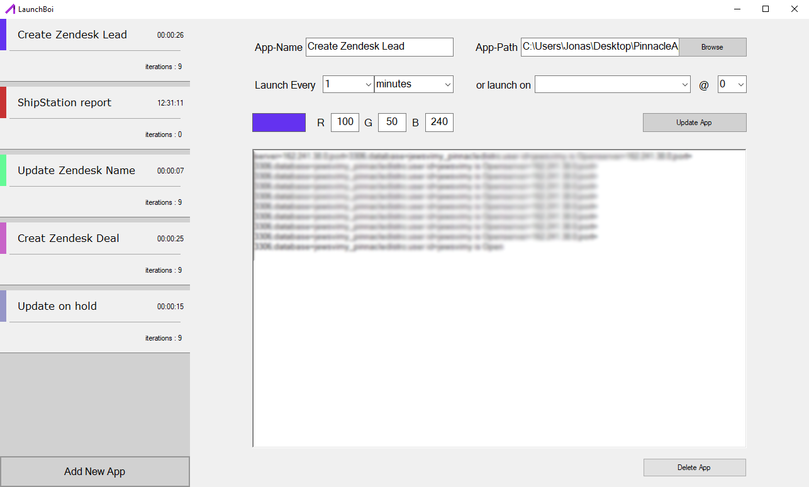

# LaunchBoi
For my position at PinnacleDistro I needed to be able to complete tasks daily. In order to increase my productivity I decided that of course I should automate all of this process and even better make an application in which I can easily track the activity that has been completed. And that is when LaunchBoi came into play.

## Basic idea
The general idea of LaunchBoi was to create an app that could easily be used by any pleb to run the many different scripts I had created and return the output from the console in a manner that could be reported upon. Whenever an application is selected it can be set to launch on an interval either for a polling type application or for a report that needs to be ran every day/hour/minute/.... For example I used the application to launch a script I made that would make a report of all the products processed by shipstation the day prior. 

## UI
